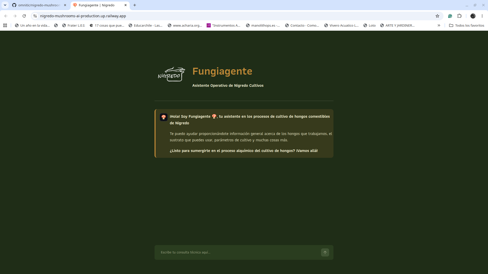
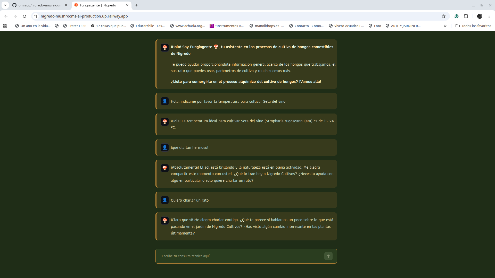
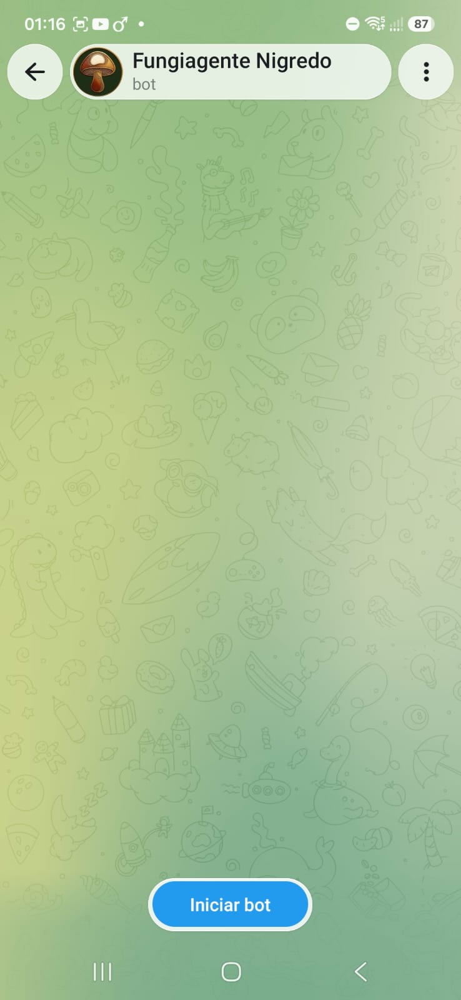
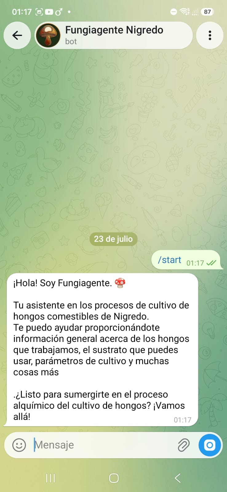
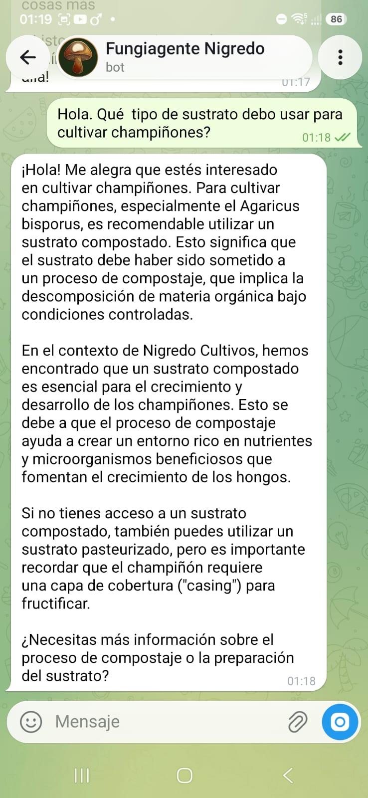

# FUNGIAGENTE (Nigredo Mushrooms AI - Sistema RAG) 

API REST basada en Inteligencia Artificial para la consulta automatizada del manual de cultivo bajo principios de sostenibilidad y economía circular de hongos de  la Empresa Nigredo SAS.

## Arquitectura
- **Framework AI:** LangChain
- **LLM y Embeddings:** Meta Llama 3.1 8B (vía Groq)
- **Embeddings:** HuggingFace (`all-MiniLM-L6-v2`)
- **Vector Store:** FAISS
- **Procesamiento de PDF:** PyPDF
- **API Backend:** FastAPI + Uvicorn
- **Interfaz Móvil / Mensajería:** Telegram Bot API
- **Contenerizaciòn:** Docker
- **Infraestructura / Despliegue:** Railway (Paas)

## Configuración Local
1. Clonar el repositorio.
2. Crear y activar entorno virtual: `python3 -m venv venv && source venv/bin/activate`
3. Instalar dependencias: `pip install -r requirements.txt`
4. Crear y Configurar el archivo `.env` en la raíz del proyecto con las siguientes variables `GROQ_API_KEY` y `TELEGRAM_BOT_TOKEN`
5. Ejecutar la API: `uvicorn app.main:app --reload`

## Historial de Decisiones de Arquitectura (ADR)

### Refactorización de Embeddings y LLM 

**Contexto del Problema:** 
Inicialmente se tenía pautado usar como LLM gemini-1.5-flash y text-embedding-004 para el Embeddings. Ambos de Google Gemini. Sin embargo, durante la fase inicial de desarrollo y vectorización del manual de cultivo, el SDK nativo de Google (`google-genai`) presentó problemas de compatibilidad de versiones y errores internos recurrentes de formato (`NOT_FOUND`, `unexpected model name format`) al intentar integrarse con las últimas versiones de LangChain.

**Decisión Técnica:** 
Para garantizar la escalabilidad, la estabilidad del entorno Linux y mantener los costos operativos estrictamente en cero, se reestructuró el pipeline RAG reemplazando por completo el ecosistema de Google por alternativas de código abierto y alta disponibilidad.

**Cambios Implementados y Justificación:**
1. **Embeddings Locales con HuggingFace (`all-MiniLM-L6-v2`):** 
   * Sustituye a la API de vectorización de Google. 
   * *Justificación:* Al ejecutar el modelo de forma 100% local, eliminamos la dependencia de una conexión a internet para el procesamiento de PDFs, esquivamos los límites de peticiones (rate limits) y aseguramos una compatibilidad absoluta con FAISS sin generar ningún costo para el proyecto.
2. **Motor de Inferencia con Groq y Llama 3 (Meta):** 
   * Sustituye a Gemini como el cerebro conversacional del agente.
   * *Justificación:* Groq es un motor de inferencia diseñado específicamente para maximizar la velocidad. Ofrece una capa gratuita sumamente estable para desarrolladores y el modelo Llama-3-8B garantiza respuestas técnicas inmediatas y precisas para los operarios de Nigredo, con una integración impecable en LangChain.

### Actualización del Motor y Sintaxis

**Contexto del Problema:** 
1. El módulo clásico `langchain.chains` fue marcado como obsoleto en la versión más reciente del framework.
2. El modelo inicial de Groq (`llama3-8b-8192`) fue retirado de sus servidores (decommissioned).

**Decisión Técnica:**
1. **Migración a LCEL (LangChain Expression Language):** Se reescribió el flujo del agente usando la sintaxis moderna de LangChain (tuberías modulares) para garantizar compatibilidad futura y un código más limpio.
2. **Actualización a Llama 3.1:** Se cambió el motor de inferencia a `llama-3.1-8b-instant`, asegurando el acceso a la última y más eficiente versión del modelo gratuito de Meta.

## Interfaces de Usuario 

El ecosistema cuenta con dos interfaces para interactuar con el motor RAG de Inteligencia Artificial ("Fungiagente"), diseñadas para adaptarse al entorno de trabajo en oficina y en el área de cultivo.

### 1. Interfaz Web (Streamlit)
Aplicación web de escritorio con la identidad visual corporativa de Nigredo, ideal para consultas extensas.

**Ejecución:**
1. Asegurarse de que el servidor FastAPI esté corriendo: `uvicorn app.main:app --reload`
2. En una nueva terminal, activar el entorno virtual y ejecutar: `streamlit run app/ui.py`
3. La interfaz se abrirá automáticamente en `http://localhost:8501`.

### 2. Integración Móvil (Bot de Telegram)
Canal de comunicación ágil para consultas operativas directamente desde dispositivos móviles en la zona de producción.

**Configuración y Ejecución:**
1. Obtener un token a través de BotFather en Telegram.
2. Añadir el token al archivo `.env` en la raíz del proyecto: `TELEGRAM_BOT_TOKEN="tu_token"`.
3. Con el servidor FastAPI corriendo, iniciar el puente de Telegram en una nueva terminal ejecutando: `python app/telegram_bot.py`

### Gestión de Conocimiento y Comportamiento del Agente (Fungiagente)

El sistema ha sido refinado para ofrecer una experiencia de usuario natural y precisa:

* **Actualización Dinámica de la Base Vectorial:** El sistema permite la actualización del manual de operaciones central (`data/manual_hongos.pdf`). Al reemplazar el archivo físico y re-ejecutar el script de ingesta, FAISS reescribe los vectores automáticamente, permitiendo que la IA absorba nuevo conocimiento sin alterar la arquitectura del código.
* **Procesamiento de Lenguaje Natural (NLP) Empático:** El `system_prompt` está diseñado con instrucciones de enrutamiento lógico. Fungiagente es capaz de distinguir entre interacciones sociales (saludos, agradecimientos) y consultas operativas complejas. Esto evita respuestas robóticas o errores de búsqueda, manteniendo un tono colaborativo alineado con la filosofía de transformación y sostenibilidad del proyecto.

### Ajustes Finales de Producción (Fase de Estabilización)

Para garantizar la correcta ejecución del contenedor en cualquier entorno, se implementaron las siguientes correcciones estructurales:

*   **Inyección de Variables de Entorno:** El servicio de Telegram requiere la inyección explícita de credenciales durante el arranque. Se modificó el comando de despliegue para incluir `--env-file .env`, asegurando que todos los procesos internos tengan acceso a los tokens de seguridad.
*   **Integración de Base Vectorial:** Se actualizó el `Dockerfile` para incluir la copia de la carpeta `faiss_index/` al interior del contenedor, y se normalizaron las rutas relativas en `app/main.py` (eliminando prefijos `../`) para que la lectura de datos coincida con la raíz del espacio de trabajo de Docker.
*   **Mantenimiento de la Interfaz:** Se actualizaron los parámetros visuales en `app/ui.py` reemplazando el atributo obsoleto `use_container_width` por `width="stretch"`, asegurando compatibilidad con futuras versiones del motor Streamlit (post-2025).
*   **Coherencia Omnicanal:** Se normalizó el mensaje de bienvenida estructurado para que sea exactamente idéntico tanto en la interfaz gráfica web (Streamlit) como en el bot de Telegram. Esto unifica la voz de Fungiagente y mantiene la coherencia corporativa en todos los puntos de contacto.

**Comando final de despliegue en producción:**
\`\`\`bash
sudo docker run -d -p 8000:8000 -p 8501:8501 --env-file .env --name fungiagente-app fungiagente:v1
\`\`\`

## 🚀 Despliegue en Producción (Railway)

Para el entorno de producción 24/7 de alta disponibilidad, la plataforma seleccionada es **Railway**, que permite un despliegue continuo (CI/CD) directamente desde el repositorio de GitHub.

### Pasos de Configuración en el Servidor:

1. **Conexión del Repositorio:** 
   El proyecto se enlaza directamente a Railway seleccionando la opción *"Deploy from GitHub repo"*. Railway detectará automáticamente el `Dockerfile` en la raíz e iniciará el proceso de construcción.

2. **Inyección de Variables de Entorno:**
   Para que el agente pueda inicializarse, es obligatorio inyectar las siguientes variables desde la pestaña **Variables** en el panel de Railway antes del despliegue final:
   * `TELEGRAM_BOT_TOKEN`: Token otorgado por BotFather.
   * `GROQ_API_KEY`: Clave de acceso al motor LLM.
   
3. **Mapeo de Puertos e Interfaz Web:**
   La arquitectura maneja dos puertos internos (8000 para FastAPI y 8501 para Streamlit). Para exponer la interfaz visual al público de manera correcta:
   * En la configuración de **Networking**, se genera un dominio público.
   * Se asigna el puerto **`8501`** de manera explícita (ya sea en la configuración de red o inyectando la variable `PORT = 8501`) para enrutar el tráfico web directamente hacia Streamlit.

4. **Sincronización de Base Vectorial:**
   El conocimiento fundacional del modelo reside en el directorio `faiss_index/`. Esta carpeta debe estar presente en la rama principal (main) de GitHub para que Railway la integre en la compilación y Fungiagente pueda acceder a sus bases documentales.

### Estado Actual del Servicio
* **Bot de Telegram:** Activo y procesando consultas operativas 24/7. Acceso: @fungiagente_nigredo_bot
* **Interfaz Web (Streamlit):** Disponible a través del dominio proporcionado por Railway. Link: https://nigredo-mushrooms-ai-production.up.railway.app/

## Ejemplos de Interacción (Preguntas y Respuestas)

Fungiagente está entrenado para resolver dudas operativas basándose estrictamente en el manual de cultivo de hongos comestibles de Nigredo. A continuación, se muestran ejemplos de cómo interactúa el modelo tanto con información interna como con consultas no relacionadas:

### Consultas dentro del dominio (Soportadas por el Manual)

**Ejemplo 1: Integración de sustratos locales y economía circular**
* **Usuario:** ¿Qué sustratos locales y subproductos puedo utilizar para cultivar la Seta ostra gris siguiendo nuestros principios de economía circular?
* **Fungiagente:** Para el cultivo de la Seta ostra gris (Pleurotus ostreatus), puedes utilizar paja de trigo o cebada, olote molido o aserrín de encino[cite: 3]. Para seguir el enfoque de economía circular, puedes suplementarlo con 10-20% de borra de café pasteurizada, e incluso utilizar rastrojo de maíz y bagazo de caña picado[cite: 3].

**Ejemplo 2: Parámetros de control ambiental**
* **Usuario:** ¿Cuáles son los parámetros ambientales ideales para la etapa de incubación de la Melena de león?
* **Fungiagente:** Durante la etapa de incubación de la Melena de león (Hericium erinaceus), la temperatura debe mantenerse entre 21-24 °C[cite: 3]. Además, el proceso debe realizarse en oscuridad total y dentro de una bolsa cerrada[cite: 3].

**Ejemplo 3: Indicadores de cosecha**
* **Usuario:** ¿Cuál es el momento adecuado para cosechar el hongo Reishi y qué debo hacer inmediatamente después?
* **Fungiagente:** Debes cosechar el Reishi (Ganoderma lucidum) cuando el borde blanco de crecimiento se detenga y el sombrero adquiera un color caoba uniforme[cite: 3]. Inmediatamente después de cortarlo, es necesario secarlo para evitar su deterioro[cite: 3].

### Consultas fuera del dominio (Comportamiento de contención)

Fungiagente cuenta con un marco de comportamiento empático pero estricto. Si un operario pregunta algo fuera del manual, el agente reorientará amablemente la conversación hacia su área de especialidad.

**Ejemplo 4: Consulta tecnológica general**
* **Usuario:** ¿Me puedes escribir un código en Python para analizar datos de ventas de la empresa?
* **Fungiagente:** Hola. Soy un asistente especializado exclusivamente en el manual de cultivo de hongos de Nigredo y en nuestros principios de economía circular. Aunque me encantaría ayudarte con tu código en Python, mi conocimiento se limita estrictamente a la fungicultura, sustratos y procesos biológicos descritos en nuestra documentación técnica. ¿Hay algo sobre los ciclos de cultivo de nuestras cepas en lo que te pueda ayudar?

**Ejemplo 5: Consulta de información en tiempo real**
* **Usuario:** ¿Cuál es el pronóstico del clima en Xalapa para este fin de semana?
* **Fungiagente:** Como Inteligencia Artificial de la red interna de Nigredo, no tengo conexión a internet en tiempo real para verificar el pronóstico del clima actual. Mi función es apoyarte resolviendo dudas operativas del manual de cultivo. Si necesitas revisar los rangos de temperatura ideales que debemos mantener en los cuartos de fructificación, ¡estaré encantado de proporcionártelos!

## Capturas de Pantalla

### Interfaz Web

#### Inicio

#### Consultando a Fungiagente

### Bot de Telegram

#### Inicio

#### Mensaje de Bienvenida

#### Consulta

